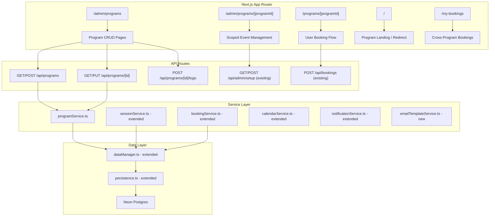

# Design Document: Booking Platform

## Overview

The Booking Platform transforms the existing single-purpose Career Maze booking tool into a multi-program booking system. Each program operates as an independent booking context with its own branding (logo, color), session configuration (duration, interval, max attendees), custom form fields, calendar invite templates, and email templates.

The upgrade is additive: a database migration introduces a `programs` table, links existing events via a `program_id` foreign key, and seeds a "Career Maze" default program. All existing API endpoints, UI flows, and business logic (waitlist promotion, overlap detection, GDPR deletion, SSE updates) continue to work unchanged. New program-aware API endpoints and UI routes are layered on top.

### Key Design Decisions

1. **Program as a configuration container**: Programs don't own sessions directly — they own events, which own sessions. This preserves the existing event→session→booking hierarchy.
2. **In-memory + Postgres dual persistence**: The existing `dataManager` pattern is extended with a `programs` store. Program data is loaded alongside events/sessions/bookings in `ensureLoaded()`.
3. **Backward-compatible routing**: Existing routes (`/`, `/book/[sessionId]`, `/admin`) continue to work. New routes are added under `/programs/[programId]` for users and `/admin/programs` for admins.
4. **Vercel Blob for logos**: Logo uploads use the already-installed `@vercel/blob` package, returning a public URL stored in the program record.
5. **Max attendees per-session snapshot**: When sessions are generated, the program's current `max_attendees` is copied to each session row, so changing the program setting doesn't retroactively alter existing sessions.

## Architecture



### Request Flow

1. User/Admin hits a Next.js page or API route
2. API route calls `ensureLoaded()` which hydrates in-memory stores (including programs) from Postgres
3. Service layer functions read/write in-memory stores
4. Mutations call `persist*` helpers to write back to Postgres
5. SSE events fire for real-time session updates (unchanged)

## Components and Interfaces

### New Service: `programService.ts`

```typescript
// src/services/programService.ts

export interface CreateProgramInput {
  name: string;
  logoUrl?: string;
  brandColor: string;
  sessionDurationMinutes: number;   // 30 | 60 | 120 | 180
  slotIntervalMinutes: number;      // 15 | 30 | 60
  maxAttendees: number;             // 1 | 2 | 3 | 5 | 10
  customFormFields: CustomFormField[];
  calendarInviteTitleTemplate?: string;
  emailTemplates?: ProgramEmailTemplates;
}

export interface UpdateProgramInput extends Partial<CreateProgramInput> {
  active?: boolean;
}

export function createProgram(input: CreateProgramInput): Program;
export function updateProgram(programId: string, input: UpdateProgramInput): Program | null;
export function getProgram(programId: string): Program | null;
export function getPrograms(): Program[];
export function getActivePrograms(): Program[];
export function getProgramByName(name: string): Program | null;
```

### New Service: `emailTemplateService.ts`

```typescript
// src/services/emailTemplateService.ts

export type NotificationType = 'confirmation' | 'cancellation' | 'waitlist_promotion' | 'reminder';

export interface EmailTemplate {
  subject: string;
  bodyHtml: string;
  headerHtml?: string;
  footerHtml?: string;
}

export interface ProgramEmailTemplates {
  confirmation?: EmailTemplate;
  cancellation?: EmailTemplate;
  waitlist_promotion?: EmailTemplate;
  reminder?: EmailTemplate;
}

export function renderEmailTemplate(
  template: EmailTemplate,
  placeholders: Record<string, string>,
  brandColor: string
): { subject: string; html: string };

export function getDefaultTemplate(type: NotificationType): EmailTemplate;

export function validateTemplate(template: EmailTemplate, type: NotificationType): { valid: boolean; errors: string[] };

export function renderPreview(
  template: EmailTemplate,
  brandColor: string
): { subject: string; html: string };
```

### Extended: `sessionService.ts`

The `createEvent` function is extended to accept a `programId` and `maxAttendees` parameter. Sessions are generated with the program's `slotIntervalMinutes` and each session stores the `maxAttendees` value at creation time.

```typescript
// Extended signature
export function createEvent(
  title: string,
  dates: string[],
  timeSlots: string[],
  location: string,
  timezone: string,
  programId: string,
  maxAttendees: number
): { event: CareerMazeEvent; sessions: Session[] };
```

### Extended: `bookingService.ts`

- `createBooking` uses the session's `maxAttendees` instead of hardcoded `3`
- Custom form field values are stored in `booking.customFields`
- `exportBookings` includes program name column

### Extended: `calendarService.ts`

- `generateIcs` accepts program config to use `calendarInviteTitleTemplate` and `sessionDurationMinutes`
- Template placeholders `{programName}` and `{userName}` are replaced in the summary

### Extended: `notificationService.ts`

- Email rendering delegates to `emailTemplateService` when a program has custom templates
- Falls back to existing hardcoded templates for the default program (backward compat)
- Brand color is applied to email header/buttons

### Extended: `dataManager.ts`

```typescript
// New additions
let programs: Program[] = [];

export function getProgramsStore(): Program[];
export function setProgramsStore(p: Program[]): void;
export function addProgram(p: Program): void;
export async function persistProgram(p: Program): Promise<void>;
```

### New API Routes

| Method | Path | Description |
|--------|------|-------------|
| GET | `/api/programs` | List all programs |
| POST | `/api/programs` | Create a program |
| GET | `/api/programs/[id]` | Get program details |
| PUT | `/api/programs/[id]` | Update program settings |
| POST | `/api/programs/[id]/logo` | Upload program logo |
| POST | `/api/programs/[id]/email-templates/preview` | Preview email template |

### New Pages

| Path | Description |
|------|-------------|
| `/admin/programs` | Admin program landing page (cards) |
| `/admin/programs/new` | Create program form |
| `/admin/programs/[programId]/settings` | Edit program settings |
| `/admin/programs/[programId]` | Scoped event management (reuses existing admin UI) |
| `/programs/[programId]` | User-facing program booking page |

### Existing Pages (Modified)

| Path | Change |
|------|--------|
| `/` | Shows program cards if multiple active programs; redirects if only one |
| `/admin` | Redirects to `/admin/programs` |
| `/book/[sessionId]` | Looks up session → event → program to apply branding and custom fields |
| `/my-bookings` | Groups bookings by program, shows program logo and brand color |
| `/cancel/[bookingId]` | Applies program brand color |

## Data Models

### New Type: `Program`

```typescript
// Added to src/models/types.ts

export interface CustomFormField {
  name: string;           // field key, e.g. "role", "department"
  label: string;          // display label, e.g. "Your Role"
  type: 'text' | 'select' | 'textarea';
  required: boolean;
  options?: string[];     // for select type
}

export interface EmailTemplate {
  subject: string;
  bodyHtml: string;
  headerHtml?: string;
  footerHtml?: string;
}

export interface ProgramEmailTemplates {
  confirmation?: EmailTemplate;
  cancellation?: EmailTemplate;
  waitlist_promotion?: EmailTemplate;
  reminder?: EmailTemplate;
}

export interface Program {
  id: string;
  name: string;
  logoUrl: string | null;
  brandColor: string;                    // hex, e.g. "#1a1a2e"
  sessionDurationMinutes: number;        // 30 | 60 | 120 | 180
  slotIntervalMinutes: number;           // 15 | 30 | 60
  maxAttendees: number;                  // 1 | 2 | 3 | 5 | 10
  customFormFields: CustomFormField[];
  calendarInviteTitleTemplate: string;   // default: "{programName} Session — {userName}"
  emailTemplates: ProgramEmailTemplates;
  active: boolean;
  createdAt: Date;
}
```

### Extended Type: `CareerMazeEvent`

```typescript
export interface CareerMazeEvent {
  // ... existing fields ...
  programId: string;  // NEW — foreign key to Program
}
```

### Extended Type: `Session`

```typescript
export interface Session {
  // ... existing fields ...
  maxAttendees: number;  // NEW — snapshot from program at creation time
}
```

### Extended Type: `Booking`

```typescript
export interface Booking {
  // ... existing fields ...
  customFields: Record<string, string> | null;  // NEW — custom form field values
}
```

### Database Schema: `programs` table

```sql
CREATE TABLE programs (
  id TEXT PRIMARY KEY,
  name TEXT NOT NULL UNIQUE,
  logo_url TEXT,
  brand_color TEXT NOT NULL DEFAULT '#1a1a2e',
  session_duration_minutes INTEGER NOT NULL DEFAULT 180,
  slot_interval_minutes INTEGER NOT NULL DEFAULT 15,
  max_attendees INTEGER NOT NULL DEFAULT 3,
  custom_form_fields JSONB NOT NULL DEFAULT '[]',
  calendar_invite_title_template TEXT NOT NULL DEFAULT '{programName} Session — {userName}',
  email_templates JSONB NOT NULL DEFAULT '{}',
  active BOOLEAN NOT NULL DEFAULT true,
  created_at TIMESTAMPTZ DEFAULT NOW()
);
```

### Database Schema Changes

```sql
-- Add program_id to events table
ALTER TABLE events ADD COLUMN program_id TEXT REFERENCES programs(id);

-- Add max_attendees to sessions table (snapshot from program)
ALTER TABLE sessions ADD COLUMN max_attendees INTEGER NOT NULL DEFAULT 3;

-- Add custom_fields to bookings table
ALTER TABLE bookings ADD COLUMN custom_fields JSONB;

-- Migration: insert default program and link existing events
INSERT INTO programs (id, name, brand_color, session_duration_minutes, slot_interval_minutes, max_attendees, custom_form_fields, calendar_invite_title_template, active, created_at)
VALUES ('default-career-maze', 'Career Maze', '#1a1a2e', 180, 15, 3,
  '[{"name":"role","label":"Role","type":"text","required":true},{"name":"pf","label":"PF","type":"text","required":true}]',
  '{programName} Session — {userName}', true, NOW());

UPDATE events SET program_id = 'default-career-maze' WHERE program_id IS NULL;
UPDATE sessions SET max_attendees = 3 WHERE max_attendees = 3;

-- Make program_id NOT NULL after migration
ALTER TABLE events ALTER COLUMN program_id SET NOT NULL;
```

### Slot Status Derivation (Extended)

The existing `deriveSlotStatus` function in `src/lib/slotStatus.ts` currently uses hardcoded thresholds based on max 3 attendees. It will be updated to accept `maxAttendees` as a parameter:

```typescript
export function deriveSlotStatus(bookingCount: number, waitlistCount: number, maxAttendees: number): SlotStatus {
  if (waitlistCount > 0) return 'Waitlisted';
  if (bookingCount >= maxAttendees) return 'Full';
  if (bookingCount > 0) return 'Limited';
  return 'Available';
}
```


## Correctness Properties

*A property is a characteristic or behavior that should hold true across all valid executions of a system — essentially, a formal statement about what the system should do. Properties serve as the bridge between human-readable specifications and machine-verifiable correctness guarantees.*

### Property 1: Program creation round-trip

*For any* valid program configuration (name, brandColor, sessionDurationMinutes, slotIntervalMinutes, maxAttendees, customFormFields, calendarInviteTitleTemplate, emailTemplates), creating a program and then retrieving it by ID should return a program with all fields matching the original input.

**Validates: Requirements 1.1, 3.2**

### Property 2: Program name uniqueness enforcement

*For any* two program creation attempts with the same name (case-insensitive), the second attempt should be rejected with an appropriate error, and the total number of programs should not increase.

**Validates: Requirements 1.5, 3.1**

### Property 3: Event-to-program association

*For any* event created within a program, the event's `programId` should equal the program's ID, and querying events filtered by that programId should include the created event.

**Validates: Requirements 1.2, 5.1, 5.2**

### Property 4: Max attendees snapshot immutability

*For any* program with existing sessions, updating the program's `maxAttendees` value should not change the `maxAttendees` of any previously created session. Only sessions created after the update should reflect the new value.

**Validates: Requirements 4.3**

### Property 5: Session capacity enforcement with configurable max attendees

*For any* session with `maxAttendees = N`, after exactly N confirmed bookings the session's slotStatus should be 'Full', and the next booking attempt should result in a waitlist entry.

**Validates: Requirements 7.4**

### Property 6: Cross-program overlap detection

*For any* user email with a confirmed booking in program A, attempting to book a session in program B that overlaps in time (within the session duration window) should be rejected.

**Validates: Requirements 7.5**

### Property 7: Custom form fields round-trip

*For any* program with custom form fields and any booking submitted with values for those fields, retrieving the booking should return the same custom field values that were submitted.

**Validates: Requirements 7.2, 7.3**

### Property 8: Calendar invite reflects program configuration

*For any* program with a custom `calendarInviteTitleTemplate` and `sessionDurationMinutes`, generating an ICS file for a booking in that program and parsing it back should yield a summary matching the rendered template and a duration matching the program's session duration.

**Validates: Requirements 8.1, 8.2, 8.3**

### Property 9: User landing page shows only active programs

*For any* set of programs with mixed active/inactive status, the user-facing program listing should return exactly the programs where `active = true`.

**Validates: Requirements 6.1**

### Property 10: Cross-program booking grouping

*For any* user email with bookings across multiple programs, querying bookings for that email and grouping by program should produce groups where every booking in each group belongs to the correct program.

**Validates: Requirements 9.1**

### Property 11: CSV export includes program name

*For any* set of bookings across programs, the CSV export should contain a "Program" column and each row's program value should match the program name of the booking's session's event.

**Validates: Requirements 5.4**

### Property 12: Email template placeholder rendering

*For any* email template containing supported placeholders and any set of valid placeholder values, rendering the template should replace every placeholder with its corresponding value, and the output should contain no unreplaced placeholder tokens.

**Validates: Requirements 13.3, 13.4**

### Property 13: Email template validation rejects missing required placeholders

*For any* confirmation email template that is missing one or more of the required placeholders (`{userName}`, `{sessionDate}`, `{sessionTime}`), validation should return `valid: false` with errors identifying the missing placeholders.

**Validates: Requirements 13.7**

### Property 14: Default email template fallback

*For any* program that has no custom email template for a given notification type, the system should use the default template, and the rendered output should contain the program name, session details, and reference code.

**Validates: Requirements 13.5**

### Property 15: Program API invalid input rejection

*For any* program creation or update request with invalid data (empty name, duplicate name, session duration not in {30, 60, 120, 180}, slot interval not in {15, 30, 60}, max attendees not in {1, 2, 3, 5, 10}), the API should return a 400 status code.

**Validates: Requirements 11.5**

### Property 16: Default calendar invite template fallback

*For any* program created without a `calendarInviteTitleTemplate`, the template should default to `"{programName} Session — {userName}"`.

**Validates: Requirements 3.4**

## Error Handling

### Program Operations
- **Duplicate program name**: Return 400 with message "A program with this name already exists"
- **Invalid session duration/interval/max attendees**: Return 400 with descriptive validation error
- **Program not found**: Return 404 with message "Program not found"
- **Logo upload failure**: Return 500 with message "Failed to upload logo"; program creation continues without logo

### Migration Errors
- **Migration failure**: Wrap entire migration in a transaction; roll back on any error
- **Missing default program**: If default program already exists (idempotent migration), skip insertion

### Booking with Custom Fields
- **Missing required custom field**: Return 400 with message identifying the missing field
- **Unknown custom field**: Silently ignore fields not defined in the program's configuration

### Email Template Errors
- **Missing required placeholders in confirmation template**: Return 400 with list of missing placeholders
- **Template rendering failure**: Fall back to default template and log the error
- **Preview rendering failure**: Return 500 with error details

### Backward Compatibility
- **Existing API endpoints**: Continue to work without `programId` parameter by defaulting to the default program
- **Existing bookings without `customFields`**: Treat as `null` / empty object
- **Existing sessions without `maxAttendees`**: Default to 3

## Testing Strategy

### Unit Tests
Unit tests cover specific examples, edge cases, and integration points:

- Default program creation with exact expected values (Req 1.3, 1.4)
- Migration script creates correct schema (Req 10.1–10.4)
- Single active program redirect behavior (Req 6.2)
- Create Program button presence on admin landing page (Req 2.3)
- Single program card display (Req 2.4)
- Logo upload integration with Vercel Blob
- Email template preview with sample data (Req 13.6)
- Backward compatibility of existing API endpoints (Req 12.1–12.5)

### Property-Based Tests
Property tests use `fast-check` (already installed) with minimum 100 iterations per test. Each test references its design document property.

| Test | Property | Tag |
|------|----------|-----|
| Program creation stores and retrieves all fields | Property 1 | Feature: booking-platform, Property 1: Program creation round-trip |
| Duplicate program names are rejected | Property 2 | Feature: booking-platform, Property 2: Program name uniqueness enforcement |
| Events are correctly associated with programs | Property 3 | Feature: booking-platform, Property 3: Event-to-program association |
| Max attendees changes don't affect existing sessions | Property 4 | Feature: booking-platform, Property 4: Max attendees snapshot immutability |
| Session becomes Full at maxAttendees and waitlists after | Property 5 | Feature: booking-platform, Property 5: Session capacity enforcement |
| Overlap detection works across programs | Property 6 | Feature: booking-platform, Property 6: Cross-program overlap detection |
| Custom form field values survive booking round-trip | Property 7 | Feature: booking-platform, Property 7: Custom form fields round-trip |
| ICS reflects program template and duration | Property 8 | Feature: booking-platform, Property 8: Calendar invite reflects program config |
| Only active programs appear in user listing | Property 9 | Feature: booking-platform, Property 9: Active programs filtering |
| Bookings group correctly by program | Property 10 | Feature: booking-platform, Property 10: Cross-program booking grouping |
| CSV export contains program name column | Property 11 | Feature: booking-platform, Property 11: CSV export includes program name |
| All placeholders are replaced in rendered templates | Property 12 | Feature: booking-platform, Property 12: Email template placeholder rendering |
| Missing required placeholders fail validation | Property 13 | Feature: booking-platform, Property 13: Email template validation |
| Default templates used when no custom template set | Property 14 | Feature: booking-platform, Property 14: Default email template fallback |
| Invalid program data returns 400 | Property 15 | Feature: booking-platform, Property 15: Program API invalid input rejection |
| Missing calendar template defaults correctly | Property 16 | Feature: booking-platform, Property 16: Default calendar invite template fallback |

### Test Configuration
- Library: `fast-check` v3.23.0 (already in devDependencies)
- Runner: `vitest` with `--run` flag
- Minimum iterations: 100 per property test
- Each property test tagged with: `Feature: booking-platform, Property {N}: {title}`
