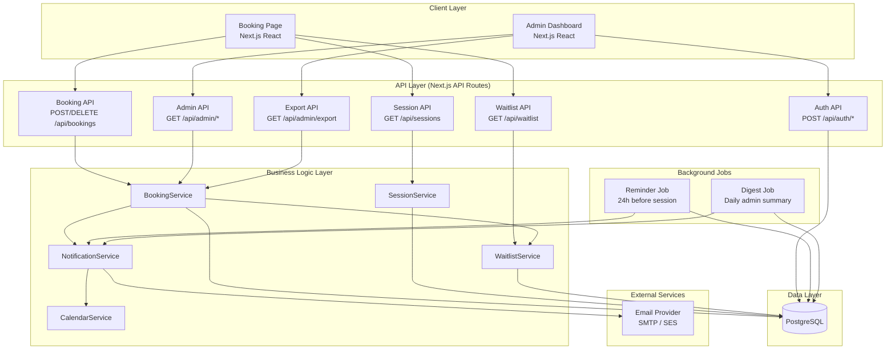
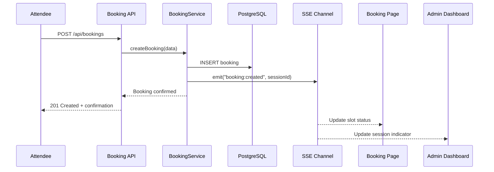
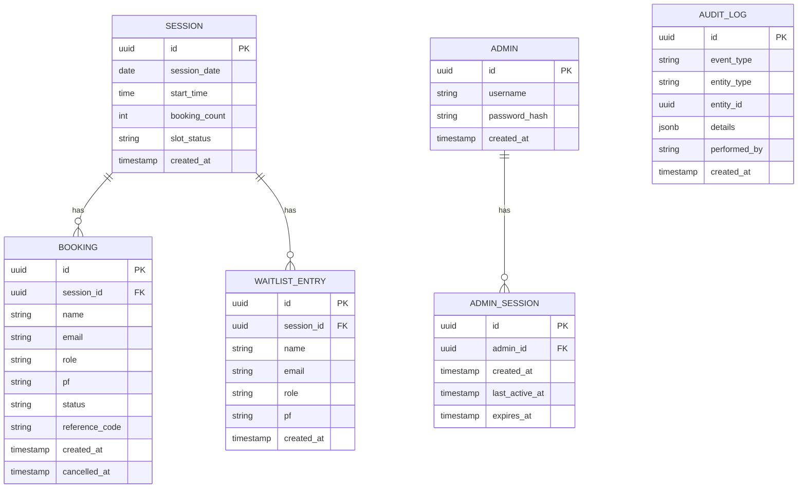

# Design Document: Career Maze Session Booking & Tracking System

## Overview

The Career Maze Session Booking & Tracking System is a full-stack web application that enables attendees to self-register for Career Maze sessions across a 20-day window (August 3–22, 2026). The system manages 360 total sessions (18 per day), each with a capacity of 3 attendees, and provides administrators with a real-time dashboard for monitoring and managing bookings.

The application consists of three main surfaces:
1. A public-facing booking page where attendees browse availability and register
2. An admin dashboard for real-time monitoring, search, filtering, and data export
3. A notification service that handles confirmation emails, calendar invites, reminders, and daily digests

### Key Design Decisions

- **Tech Stack**: Next.js (React) with TypeScript for the frontend and API routes, PostgreSQL for persistent storage, and a background job runner for scheduled notifications.
- **Real-time Updates**: Server-Sent Events (SSE) for pushing booking/cancellation changes to the Booking Page and Admin Dashboard within 5 seconds.
- **Calendar Invites**: Generated server-side using the `ics` library, producing RFC 5545-compliant `.ics` files attached to emails.
- **Email Delivery**: Abstracted behind a `NotificationService` interface, with an initial implementation using an SMTP provider (e.g., AWS SES or SendGrid).
- **Authentication**: Session-based authentication for admins with a 30-minute inactivity timeout. API endpoints use bearer tokens.
- **Timezone Handling**: All session times stored in UTC internally, displayed in `Europe/London` on the frontend. The `ics` files specify `Europe/London` timezone.
- **Greenfield Project**: No existing codebase — the system is built from scratch.

## Architecture

The system follows a layered architecture with clear separation between the presentation layer, API layer, business logic, and data access.



### Real-Time Update Flow



## Components and Interfaces

### SessionService

Responsible for generating and querying the fixed session schedule.

```typescript
interface SessionService {
  /** Generate all 360 sessions for Aug 3–22, 2026 */
  generateSessions(): Promise<Session[]>;

  /** Get all sessions, optionally filtered */
  getSessions(filters?: SessionFilter): Promise<Session[]>;

  /** Get a single session by ID */
  getSession(sessionId: string): Promise<Session | null>;

  /** Get sessions for a specific date */
  getSessionsByDate(date: string): Promise<Session[]>;
}

interface SessionFilter {
  date?: string;          // ISO date string
  timeRange?: { start: string; end: string };
  status?: SlotStatus;
}
```

### BookingService

Core business logic for creating, cancelling, and querying bookings. Enforces capacity limits and the 3-hour overlap rule.

```typescript
interface BookingService {
  /** Create a booking or add to waitlist if full */
  createBooking(data: BookingRequest): Promise<BookingResult>;

  /** Cancel a confirmed booking, trigger waitlist promotion */
  cancelBooking(bookingId: string, email: string): Promise<void>;

  /** Get bookings for a session */
  getBookingsBySession(sessionId: string): Promise<Booking[]>;

  /** Get bookings for an attendee by email */
  getBookingsByEmail(email: string): Promise<Booking[]>;

  /** Search bookings by name, email, or PF */
  searchBookings(query: string): Promise<Booking[]>;

  /** Export bookings as CSV or Excel */
  exportBookings(filters?: SessionFilter, format?: 'csv' | 'xlsx'): Promise<Buffer>;
}

interface BookingRequest {
  sessionId: string;
  name: string;
  email: string;
  role: string;
  pf: string;
}

type BookingResult =
  | { status: 'confirmed'; booking: Booking }
  | { status: 'waitlisted'; waitlistEntry: WaitlistEntry }
  | { status: 'rejected'; reason: string };
```

### WaitlistService

Manages the FIFO waitlist queue per session.

```typescript
interface WaitlistService {
  /** Add an attendee to the waitlist for a session */
  addToWaitlist(sessionId: string, data: BookingRequest): Promise<WaitlistEntry>;

  /** Promote the earliest waitlist entry to a confirmed booking */
  promoteNext(sessionId: string): Promise<Booking | null>;

  /** Get waitlist entries for a session */
  getWaitlist(sessionId: string): Promise<WaitlistEntry[]>;

  /** Remove a waitlist entry */
  removeFromWaitlist(waitlistEntryId: string): Promise<void>;
}
```

### NotificationService

Handles all outbound email communications.

```typescript
interface NotificationService {
  /** Send booking confirmation with .ics attachment */
  sendConfirmation(booking: Booking, session: Session): Promise<void>;

  /** Send cancellation confirmation */
  sendCancellation(booking: Booking, session: Session): Promise<void>;

  /** Send waitlist promotion notification with .ics attachment */
  sendWaitlistPromotion(booking: Booking, session: Session): Promise<void>;

  /** Send 24-hour reminder */
  sendReminder(booking: Booking, session: Session): Promise<void>;

  /** Send daily digest to all admins */
  sendDailyDigest(stats: DailyStats): Promise<void>;
}
```

### CalendarService

Generates RFC 5545-compliant `.ics` files.

```typescript
interface CalendarService {
  /** Generate an .ics file for a booking */
  generateIcs(booking: Booking, session: Session): string;

  /** Parse an .ics string back to event data (for testing round-trip) */
  parseIcs(icsContent: string): CalendarEvent;
}

interface CalendarEvent {
  startTime: Date;
  endTime: Date;
  summary: string;
  timezone: string;
}
```

### API Endpoints

| Method | Path | Auth | Description |
|--------|------|------|-------------|
| GET | `/api/sessions` | No | List sessions with optional filters |
| GET | `/api/sessions/:id` | No | Get single session details |
| POST | `/api/bookings` | No | Create a booking |
| DELETE | `/api/bookings/:id` | No | Cancel a booking (requires email in body) |
| GET | `/api/bookings` | Token | List bookings (admin) |
| GET | `/api/waitlist/:sessionId` | Token | Get waitlist for a session |
| POST | `/api/auth/login` | No | Admin login |
| POST | `/api/auth/logout` | Session | Admin logout |
| GET | `/api/admin/stats` | Session | Dashboard statistics |
| GET | `/api/admin/export` | Session | Export bookings as CSV/Excel |
| GET | `/api/admin/search` | Session | Search bookings |

### SSE Channel

```typescript
// GET /api/events — Server-Sent Events stream
// Events emitted:
//   "session:updated" — { sessionId, bookingCount, slotStatus }
//   "booking:created" — { sessionId, bookingId }
//   "booking:cancelled" — { sessionId, bookingId }
```

## Data Models

### Entity Relationship Diagram



### Session

| Field | Type | Constraints | Description |
|-------|------|-------------|-------------|
| id | UUID | PK | Unique session identifier |
| session_date | DATE | NOT NULL | Date of the session (Aug 3–22, 2026) |
| start_time | TIME | NOT NULL | Start time in UTC |
| booking_count | INTEGER | NOT NULL, DEFAULT 0, CHECK (0–3) | Current confirmed bookings |
| slot_status | ENUM | NOT NULL | Computed: Available, Limited, Full, Waitlisted |
| created_at | TIMESTAMP | NOT NULL | Record creation time |

Unique constraint on `(session_date, start_time)`.

### Booking

| Field | Type | Constraints | Description |
|-------|------|-------------|-------------|
| id | UUID | PK | Unique booking identifier |
| session_id | UUID | FK → Session | Associated session |
| name | VARCHAR(255) | NOT NULL | Attendee name (encrypted at rest) |
| email | VARCHAR(255) | NOT NULL | Attendee email (encrypted at rest) |
| role | VARCHAR(255) | NOT NULL | Attendee role (encrypted at rest) |
| pf | VARCHAR(100) | NOT NULL | Performance Factor (encrypted at rest) |
| status | ENUM | NOT NULL | confirmed, cancelled |
| reference_code | VARCHAR(20) | UNIQUE, NOT NULL | Human-readable booking reference |
| created_at | TIMESTAMP | NOT NULL | Booking creation time |
| cancelled_at | TIMESTAMP | NULL | Cancellation time, if applicable |

Index on `(email, status)` for overlap checking. Index on `(session_id, status)` for session booking queries.

### WaitlistEntry

| Field | Type | Constraints | Description |
|-------|------|-------------|-------------|
| id | UUID | PK | Unique waitlist entry identifier |
| session_id | UUID | FK → Session | Associated session |
| name | VARCHAR(255) | NOT NULL | Attendee name (encrypted at rest) |
| email | VARCHAR(255) | NOT NULL | Attendee email (encrypted at rest) |
| role | VARCHAR(255) | NOT NULL | Attendee role (encrypted at rest) |
| pf | VARCHAR(100) | NOT NULL | Performance Factor (encrypted at rest) |
| created_at | TIMESTAMP | NOT NULL | Waitlist join time (used for FIFO ordering) |

Index on `(session_id, created_at)` for FIFO promotion.

### Admin

| Field | Type | Constraints | Description |
|-------|------|-------------|-------------|
| id | UUID | PK | Unique admin identifier |
| username | VARCHAR(100) | UNIQUE, NOT NULL | Admin login username |
| password_hash | VARCHAR(255) | NOT NULL | bcrypt-hashed password |
| created_at | TIMESTAMP | NOT NULL | Record creation time |

### AdminSession

| Field | Type | Constraints | Description |
|-------|------|-------------|-------------|
| id | UUID | PK | Session token |
| admin_id | UUID | FK → Admin | Associated admin |
| created_at | TIMESTAMP | NOT NULL | Session start |
| last_active_at | TIMESTAMP | NOT NULL | Last activity timestamp |
| expires_at | TIMESTAMP | NOT NULL | Absolute expiry (last_active_at + 30 min) |

### AuditLog

| Field | Type | Constraints | Description |
|-------|------|-------------|-------------|
| id | UUID | PK | Unique log entry identifier |
| event_type | VARCHAR(50) | NOT NULL | e.g., booking_created, booking_cancelled, data_accessed |
| entity_type | VARCHAR(50) | NOT NULL | e.g., booking, session, admin |
| entity_id | UUID | NOT NULL | ID of the affected entity |
| details | JSONB | NULL | Additional event context |
| performed_by | VARCHAR(255) | NOT NULL | Email or admin username |
| created_at | TIMESTAMP | NOT NULL | Event timestamp |

### Slot Status Derivation

The `slot_status` is a computed value based on `booking_count` and waitlist presence:

```typescript
function deriveSlotStatus(bookingCount: number, waitlistCount: number): SlotStatus {
  if (bookingCount === 0) return 'Available';
  if (bookingCount < 3) return 'Limited';
  if (waitlistCount > 0) return 'Waitlisted';
  return 'Full';
}
```

### 3-Hour Overlap Check

```typescript
function hasOverlap(existingBookings: { startTime: Date }[], newStartTime: Date): boolean {
  const THREE_HOURS_MS = 3 * 60 * 60 * 1000;
  return existingBookings.some(b => {
    const existingEnd = new Date(b.startTime.getTime() + THREE_HOURS_MS);
    const newEnd = new Date(newStartTime.getTime() + THREE_HOURS_MS);
    return newStartTime < existingEnd && b.startTime < newEnd;
  });
}
```

## Correctness Properties

*A property is a characteristic or behavior that should hold true across all valid executions of a system — essentially, a formal statement about what the system should do. Properties serve as the bridge between human-readable specifications and machine-verifiable correctness guarantees.*

### Property 1: Session generation produces valid time slots

*For all* generated sessions, the start time minutes must be in {0, 15, 30}, the hour must fall within the morning window (9:00–11:45) or afternoon window (14:00–15:15) in Europe/London, no session falls in the lunch break (12:00–13:59), and the capacity is exactly 3.

**Validates: Requirements 1.1, 1.3, 1.4**

### Property 2: Slot status derivation

*For any* session with a booking count in [0, 3] and a waitlist count ≥ 0, the derived slot status must be: "Available" when booking count is 0, "Limited" when booking count is 1 or 2, "Full" when booking count is 3 and waitlist count is 0, and "Waitlisted" when booking count is 3 and waitlist count > 0.

**Validates: Requirements 2.2**

### Property 3: 3-hour overlap detection

*For any* attendee with a confirmed booking, and any other session whose 3-hour window overlaps with the booked session's 3-hour window, the system must reject the second booking. Conversely, if the windows do not overlap, the booking must be allowed (assuming capacity is available).

**Validates: Requirements 1.5, 3.5**

### Property 4: Booking routing by capacity

*For any* valid booking request and any session, if the session has fewer than 3 confirmed bookings, the result must be a confirmed booking with the session's booking count incremented by 1. If the session has exactly 3 confirmed bookings, the result must be a waitlist entry with the booking count unchanged.

**Validates: Requirements 3.2, 3.3, 4.1**

### Property 5: Waitlist FIFO ordering

*For any* session with multiple waitlist entries, the entries must be ordered by their creation timestamp in ascending order, and promotion must always select the entry with the earliest timestamp.

**Validates: Requirements 4.2**

### Property 6: Cancellation decrements count and frees slot or promotes waitlist

*For any* confirmed booking, cancelling it must set the booking status to "cancelled", decrement the session's booking count by 1, and either make the slot available for new bookings (if no waitlist entries exist) or promote the earliest waitlist entry to a confirmed booking (if waitlist entries exist).

**Validates: Requirements 5.1, 5.2, 5.3, 4.3**

### Property 7: Calendar invite round-trip

*For any* confirmed booking and its associated session, generating an .ics calendar invite and then parsing it back must produce an event with the same session date, start time (in Europe/London timezone), and 3-hour duration as the original.

**Validates: Requirements 6.1, 6.4, 6.5**

### Property 8: Booking confirmation contains required fields

*For any* successfully created booking, the confirmation response must include the session date, session time, and a unique booking reference code.

**Validates: Requirements 3.4**

### Property 9: Reminder job selects correct sessions and attendees

*For any* set of sessions, the reminder job must select exactly those sessions starting within the next 24 hours, and for each selected session, it must target all attendees with confirmed bookings.

**Validates: Requirements 7.4**

### Property 10: Summary statistics accuracy

*For any* set of sessions and bookings on a given day, the computed summary statistics (total bookings, full sessions, empty sessions, waitlist count) must equal the values derived by counting the actual booking and waitlist records.

**Validates: Requirements 7.5, 8.4**

### Property 11: Dashboard color indicator mapping

*For any* session, the color indicator must be Green when booking count is 0 or 1, Yellow when booking count is 2, and Red when booking count is 3.

**Validates: Requirements 8.2**

### Property 12: Session and booking filtering

*For any* filter combination (date, time range, capacity status), the returned sessions must all satisfy every active filter criterion, and no session satisfying all criteria may be excluded from the results.

**Validates: Requirements 8.5, 9.2**

### Property 13: Booking search returns matching results

*For any* search query string, all returned bookings must contain the query string in at least one of: attendee name, email, or PF.

**Validates: Requirements 8.6**

### Property 14: Export contains all required fields

*For any* set of bookings, the exported CSV/Excel file must contain one row per booking, and each row must include: booking ID, session date, session time, attendee name, email, role, PF, booking timestamp, and status.

**Validates: Requirements 9.1**

### Property 15: Admin session expiry after inactivity

*For any* admin session, if the time elapsed since `last_active_at` exceeds 30 minutes, the session must be considered expired and any request using that session must be rejected.

**Validates: Requirements 10.4**

### Property 16: Booking API round-trip

*For any* valid booking creation request, creating a booking via the API and then retrieving it via the API must return a booking object whose name, email, role, PF, session ID, and status match the original request data.

**Validates: Requirements 12.4**

### Property 17: API validation returns correct error codes

*For any* API request with invalid or missing required parameters, the system must return HTTP 400 with a descriptive error message. For any request to a protected endpoint without a valid authentication token, the system must return HTTP 401.

**Validates: Requirements 3.1, 12.2, 12.3**

### Property 18: GDPR data deletion removes personal data

*For any* attendee who requests data deletion, after processing the deletion, no booking or waitlist entry in the system must contain that attendee's name, email, role, or PF.

**Validates: Requirements 11.3**

### Property 19: Audit logging for data operations

*For any* booking creation, cancellation, or data access operation, the system must create an audit log entry with the correct event type, entity reference, and performer identity.

**Validates: Requirements 11.4**

## Error Handling

### Booking Errors

| Error Scenario | HTTP Status | User-Facing Message | System Behavior |
|---|---|---|---|
| Missing required fields (name, email, role, PF) | 400 | "Please fill in all required fields" | Reject request, return field-level validation errors |
| Invalid email format | 400 | "Please enter a valid email address" | Reject request |
| Session not found | 404 | "This session is no longer available" | Reject request |
| 3-hour overlap conflict | 409 | "You already have a booking within 3 hours of this session" | Reject request, return conflicting booking details |
| Session full (no waitlist opt-in) | 409 | "This session is full. Would you like to join the waitlist?" | Prompt user for waitlist |
| Duplicate booking (same email, same session) | 409 | "You already have a booking for this session" | Reject request |

### Cancellation Errors

| Error Scenario | HTTP Status | User-Facing Message | System Behavior |
|---|---|---|---|
| Booking not found | 404 | "Booking not found" | Reject request |
| Email mismatch | 403 | "You are not authorized to cancel this booking" | Reject request |
| Already cancelled | 409 | "This booking has already been cancelled" | Reject request |

### Authentication Errors

| Error Scenario | HTTP Status | User-Facing Message | System Behavior |
|---|---|---|---|
| Invalid credentials | 401 | "Invalid username or password" | Reject login, no session created |
| Session expired | 401 | "Your session has expired. Please log in again" | Redirect to login |
| Missing auth token (API) | 401 | "Authentication required" | Reject request |

### Notification Errors

| Error Scenario | System Behavior |
|---|---|
| Email delivery failure | Log error, retry up to 3 times with exponential backoff, alert admin after final failure |
| ICS generation failure | Log error, send confirmation email without attachment, flag for manual follow-up |
| SMTP connection timeout | Queue email for retry, continue processing other notifications |

### General Error Handling Principles

- All errors are logged to the audit log with full context
- User-facing error messages are descriptive but do not expose internal system details
- Database operations use transactions to maintain consistency (e.g., booking creation + count increment are atomic)
- Concurrent booking attempts for the last slot are handled via database-level locking (SELECT FOR UPDATE) to prevent overbooking

## Testing Strategy

### Dual Testing Approach

The system uses both unit tests and property-based tests for comprehensive coverage:

- **Unit tests** verify specific examples, edge cases, integration points, and error conditions
- **Property-based tests** verify universal properties across randomly generated inputs
- Together they provide comprehensive coverage — unit tests catch concrete bugs, property tests verify general correctness

### Property-Based Testing Configuration

- **Library**: [fast-check](https://github.com/dubzzz/fast-check) for TypeScript/JavaScript
- **Minimum iterations**: 100 per property test
- **Each property test must reference its design document property** using the tag format:
  `Feature: career-maze-booking, Property {number}: {property_text}`
- **Each correctness property must be implemented by a single property-based test**

### Test Categories

#### Property-Based Tests (fast-check)

| Property | Test Description | Key Generators |
|---|---|---|
| P1: Session generation | Verify all generated sessions have valid times, windows, and capacity | N/A (deterministic generation, verify invariants) |
| P2: Slot status derivation | Verify status mapping for random booking/waitlist counts | `fc.integer({min:0, max:3})`, `fc.integer({min:0, max:50})` |
| P3: Overlap detection | Verify 3-hour window overlap logic for random time pairs | `fc.date()`, random session time pairs |
| P4: Booking routing | Verify confirmed vs waitlisted based on random capacity states | Random sessions with varying booking counts |
| P5: Waitlist FIFO | Verify ordering after random insertions | Random waitlist entries with timestamps |
| P6: Cancellation | Verify count decrement and waitlist promotion | Random sessions with bookings and waitlist |
| P7: ICS round-trip | Generate ICS then parse back, verify match | Random booking/session data |
| P8: Confirmation fields | Verify response contains required fields | Random valid booking requests |
| P9: Reminder selection | Verify correct session/attendee selection | Random session dates relative to "now" |
| P10: Summary stats | Verify computed stats match actual counts | Random sets of sessions and bookings |
| P11: Color indicator | Verify color mapping for random booking counts | `fc.integer({min:0, max:3})` |
| P12: Filtering | Verify filter results match criteria | Random sessions and filter combinations |
| P13: Search | Verify search results contain query string | Random bookings and query strings |
| P14: Export fields | Verify export rows contain all required columns | Random booking datasets |
| P15: Session expiry | Verify expiry logic for random timestamps | Random `last_active_at` and current times |
| P16: Booking API round-trip | Create then retrieve, verify match | Random valid booking requests |
| P17: API validation | Verify error codes for random invalid requests | Random malformed request payloads |
| P18: Data deletion | Verify personal data removal after deletion | Random attendee data |
| P19: Audit logging | Verify log entries created for operations | Random operations |

#### Unit Tests

| Area | Test Cases |
|---|---|
| Session generation | Verify exactly 360 sessions, 18 per day, correct date range (Req 1.2) |
| Booking flow | Happy path: create booking, verify confirmation (Req 3.2, 3.4) |
| Waitlist promotion | Cancel booking with waitlist, verify promotion notification triggered (Req 4.3, 4.4) |
| Cancellation | Cancel booking, verify status change and notification (Req 5.1, 5.4) |
| Auth flow | Valid login, invalid login, unauthenticated redirect (Req 10.1, 10.2, 10.3) |
| API endpoints | Verify all endpoints exist and respond (Req 12.1) |
| Notification triggers | Verify confirmation, cancellation, promotion emails triggered (Req 7.1, 7.2, 7.3) |
| Dashboard display | Verify all 360 sessions rendered (Req 8.1) |
| Export | Verify CSV download for sample data (Req 9.1) |
| Empty search results | Verify empty array returned for non-matching query |
| Edge: booking at capacity boundary | Book 3rd slot, verify confirmed; book 4th, verify waitlisted |
| Edge: cancel last booking with no waitlist | Verify slot becomes available, no promotion attempted |
| Edge: overlapping sessions at boundary | Sessions exactly 3 hours apart should not conflict |
